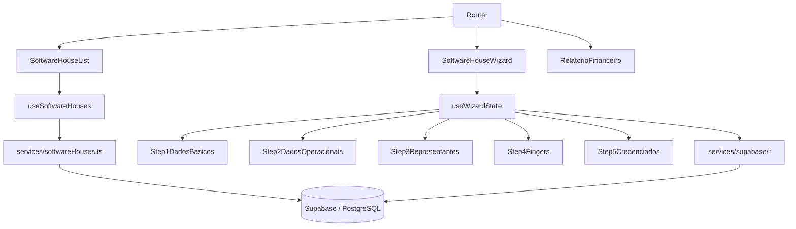

# Software House Management — Design

**Spec**: `.specs/features/sh-management/spec.md`
**Status**: Draft

---

## Architecture Overview

Aplicação SPA (React + Vite + TypeScript + Tailwind) com Supabase como backend. Toda comunicação com dados passa pela camada `services/supabase/`, consumida por custom hooks (`hooks/`), que alimentam os componentes de página e wizard.

O wizard de 5 passos usa estado local gerenciado por `useWizardState` — os dados acumulam em memória durante o wizard e só são persistidos no Supabase no passo final ("Finalizar Criação"), em uma transação única.



---

## Estrutura de Rotas

| Rota | Componente | Requisito |
|------|-----------|-----------|
| `/software-house` | `SoftwareHouseList` | SH-01 |
| `/software-house/nova` | `SoftwareHouseWizard` (modo: create) | SH-02~06 |
| `/software-house/:id/editar` | `SoftwareHouseWizard` (modo: edit) | SH-07 |
| `/software-house/relatorio` | `RelatorioFinanceiro` | SH-08 |

---

## Data Models — Supabase (PostgreSQL)

### Tabela: `software_houses`

```sql
CREATE TABLE software_houses (
  id            uuid PRIMARY KEY DEFAULT gen_random_uuid(),
  cnpj          varchar(18) UNIQUE NOT NULL,
  nome_fantasia varchar(255) NOT NULL,
  razao_social  varchar(255) NOT NULL,
  email         varchar(255) NOT NULL,
  telefone      varchar(20) NOT NULL,
  cep           varchar(9) NOT NULL,
  logradouro    varchar(255) NOT NULL,
  numero        varchar(20) NOT NULL,
  bairro        varchar(100) NOT NULL,
  municipio     varchar(100) NOT NULL,
  estado        char(2) NOT NULL,
  prazo_pagamento integer NOT NULL DEFAULT 30,
  participacao_sh decimal(5,2) DEFAULT 0,
  participacao_representante decimal(5,2) DEFAULT 0,
  status        varchar(10) NOT NULL DEFAULT 'ativa' CHECK (status IN ('ativa', 'inativa')),
  created_at    timestamptz DEFAULT now(),
  updated_at    timestamptz DEFAULT now()
);
```

### Tabela: `sh_representantes`

```sql
CREATE TABLE sh_representantes (
  id                 uuid PRIMARY KEY DEFAULT gen_random_uuid(),
  software_house_id  uuid NOT NULL REFERENCES software_houses(id) ON DELETE CASCADE,
  nome_completo      varchar(255) NOT NULL,
  email              varchar(255) NOT NULL,
  telefone           varchar(20) NOT NULL,
  cpf                varchar(14) NOT NULL,
  cidade             varchar(100),
  estado             char(2),
  data_vinculo       timestamptz DEFAULT now(),
  created_at         timestamptz DEFAULT now()
);
```

### Tabela: `sh_fingers`

```sql
CREATE TABLE sh_fingers (
  id                 uuid PRIMARY KEY DEFAULT gen_random_uuid(),
  software_house_id  uuid NOT NULL REFERENCES software_houses(id) ON DELETE CASCADE,
  nome_completo      varchar(255) NOT NULL,
  email              varchar(255) NOT NULL,
  telefone           varchar(20) NOT NULL,
  cpf                varchar(14) NOT NULL,
  porcentagem        decimal(5,2) NOT NULL DEFAULT 0,
  prazo_meses        integer,
  cidade             varchar(100),
  estado             char(2),
  data_vinculo       timestamptz DEFAULT now(),
  created_at         timestamptz DEFAULT now()
);
```

### Tabela: `credenciados` (entidade existente — confirmar se já existe)

```sql
-- Provavelmente já existe no Supabase. Se não existir:
CREATE TABLE credenciados (
  id            uuid PRIMARY KEY DEFAULT gen_random_uuid(),
  nome          varchar(255) NOT NULL,
  cnpj          varchar(18) UNIQUE NOT NULL,
  cidade        varchar(100),
  estado        char(2),
  created_at    timestamptz DEFAULT now()
);
```

### Tabela: `sh_credenciados` (junction — vínculo SH ↔ Credenciado)

```sql
CREATE TABLE sh_credenciados (
  id                  uuid PRIMARY KEY DEFAULT gen_random_uuid(),
  software_house_id   uuid NOT NULL REFERENCES software_houses(id) ON DELETE CASCADE,
  credenciado_id      uuid NOT NULL REFERENCES credenciados(id),
  representante_id    uuid NOT NULL REFERENCES sh_representantes(id),
  finger_id           uuid NOT NULL REFERENCES sh_fingers(id),
  created_at          timestamptz DEFAULT now(),
  UNIQUE(software_house_id, credenciado_id)
);
```

### TypeScript Interfaces

```typescript
// src/types/sh.types.ts

export type SHStatus = 'ativa' | 'inativa'

export interface SoftwareHouse {
  id: string
  cnpj: string
  nome_fantasia: string
  razao_social: string
  email: string
  telefone: string
  cep: string
  logradouro: string
  numero: string
  bairro: string
  municipio: string
  estado: string
  prazo_pagamento: number
  participacao_sh: number
  participacao_representante: number
  status: SHStatus
  created_at: string
  updated_at: string
  // computed via JOIN
  qtd_lojas_vinculadas?: number
  qtd_representantes?: number
}

export interface Representante {
  id: string
  software_house_id: string
  nome_completo: string
  email: string
  telefone: string
  cpf: string
  cidade?: string
  estado?: string
  data_vinculo: string
}

export interface Finger {
  id: string
  software_house_id: string
  nome_completo: string
  email: string
  telefone: string
  cpf: string
  porcentagem: number
  prazo_meses?: number
  cidade?: string
  estado?: string
  data_vinculo: string
}

export interface Credenciado {
  id: string
  nome: string
  cnpj: string
  cidade?: string
  estado?: string
}

export interface SHCredenciado {
  id: string
  software_house_id: string
  credenciado_id: string
  representante_id: string
  finger_id: string
  credenciado: Credenciado
  representante: Representante
  finger: Finger
}

// Wizard state — acumulado em memória durante os 5 passos
export interface WizardState {
  step: 1 | 2 | 3 | 4 | 5
  dadosBasicos: Partial<Pick<SoftwareHouse,
    'cnpj' | 'nome_fantasia' | 'razao_social' | 'email' | 'telefone' |
    'cep' | 'logradouro' | 'numero' | 'bairro' | 'municipio' | 'estado'
  >>
  dadosOperacionais: Partial<Pick<SoftwareHouse,
    'prazo_pagamento' | 'participacao_sh' | 'participacao_representante'
  >>
  representantes: Omit<Representante, 'id' | 'software_house_id' | 'data_vinculo'>[]
  fingers: Omit<Finger, 'id' | 'software_house_id' | 'data_vinculo'>[]
  credenciados: { credenciado_id: string; representante_idx: number; finger_idx: number }[]
}
```

---

## Components

### Pages

#### `SoftwareHouseList`
- **Purpose**: Tela principal de listagem de SHs com filtros, tabela e ações
- **Location**: `src/pages/SoftwareHouseList.tsx`
- **Usa**: `useSoftwareHouses`, `SHTable`, `SHFilters`
- **Interfaces**: nenhuma prop (é uma página/rota)

#### `SoftwareHouseWizard`
- **Purpose**: Container do wizard de 5 passos; gerencia navegação entre steps e persiste no final
- **Location**: `src/pages/SoftwareHouseWizard.tsx`
- **Props**: `mode: 'create' | 'edit'`, `shId?: string` (vem do router)
- **Usa**: `useWizardState`, `WizardStepper`, `Step1..Step5`

#### `RelatorioFinanceiro`
- **Purpose**: Relatório financeiro consolidado com filtros e exportação
- **Location**: `src/pages/RelatorioFinanceiro.tsx`
- **Usa**: `useRelatorio`, `RelatorioTotaisCards`, `RelatorioTabela`, `RelatorioFiltros`

---

### Shared Components

#### `WizardStepper`
- **Purpose**: Barra de progresso do wizard com 5 steps (numerado, check verde, estado ativo)
- **Location**: `src/components/sh/WizardStepper.tsx`
- **Props**: `currentStep: number`, `steps: { label: string; sublabel: string }[]`

#### `SHTable`
- **Purpose**: Tabela de SHs com colunas: nome/CNPJ/cidade, lojas, representantes, status, ações
- **Location**: `src/components/sh/SHTable.tsx`
- **Props**: `data: SoftwareHouse[]`, `onEdit: (id) => void`, `onReport: (id) => void`, `pagination`

#### `SHStatusBadge`
- **Purpose**: Badge colorido Ativa (verde) / Inativa (cinza)
- **Location**: `src/components/sh/SHStatusBadge.tsx`
- **Props**: `status: SHStatus`

---

### Wizard Steps

#### `Step1DadosBasicos`
- **Purpose**: Formulário com dados básicos + endereço com autocompletar CEP (ViaCEP)
- **Location**: `src/components/wizard-steps/Step1DadosBasicos.tsx`
- **Props**: `defaultValues`, `onNext: (data) => void`, `onCancel: () => void`
- **Libs**: react-hook-form, zod, axios (ViaCEP)

#### `Step2DadosOperacionais`
- **Purpose**: Formulário com prazo e percentuais de comissão
- **Location**: `src/components/wizard-steps/Step2DadosOperacionais.tsx`
- **Props**: `defaultValues`, `onNext: (data) => void`, `onBack: () => void`

#### `Step3Representantes`
- **Purpose**: Tabela de representantes vinculados + botão adicionar + filtro interno
- **Location**: `src/components/wizard-steps/Step3Representantes.tsx`
- **Props**: `representantes: Representante[]`, `onAdd`, `onEdit`, `onRemove`, `onNext`, `onBack`
- **Usa**: `ModalRepresentante`

#### `Step4Fingers`
- **Purpose**: Tabela de fingers vinculados + botão adicionar + filtro interno
- **Location**: `src/components/wizard-steps/Step4Fingers.tsx`
- **Props**: `fingers: Finger[]`, `onAdd`, `onEdit`, `onRemove`, `onNext`, `onBack`
- **Usa**: `ModalFinger`

#### `Step5Credenciados`
- **Purpose**: Busca de credenciados disponíveis, lista vinculados, finalizar criação
- **Location**: `src/components/wizard-steps/Step5Credenciados.tsx`
- **Props**: `representantes`, `fingers`, `onFinalize: (credenciados) => void`, `onBack`
- **Usa**: `ModalVincularCredenciado`

---

### Modals

#### `ModalRepresentante`
- **Purpose**: Adicionar ou editar um representante (formulário com validação CPF)
- **Location**: `src/components/modals/ModalRepresentante.tsx`
- **Props**: `open`, `onClose`, `onSave: (data) => void`, `defaultValues?`

#### `ModalFinger`
- **Purpose**: Adicionar ou editar um finger com % e prazo
- **Location**: `src/components/modals/ModalFinger.tsx`
- **Props**: `open`, `onClose`, `onSave: (data) => void`, `defaultValues?`

#### `ModalVincularCredenciado`
- **Purpose**: Selecionar Representante + Finger para vincular ao credenciado escolhido
- **Location**: `src/components/modals/ModalVincularCredenciado.tsx`
- **Props**: `open`, `onClose`, `credenciado`, `representantes`, `fingers`, `onConfirm: (repId, fingerId) => void`

---

## Hooks

### `useSoftwareHouses`
```typescript
// Listagem com filtros e paginação
const { data, isLoading, filters, setFilters, pagination } = useSoftwareHouses()

// CRUD
const { create, update, remove } = useSoftwareHouseMutations()
```

### `useWizardState`
```typescript
// Gerencia acumulação de dados dos 5 passos em memória
const {
  state,          // WizardState completo
  currentStep,
  goToStep,
  updateDadosBasicos,
  updateDadosOperacionais,
  addRepresentante,
  updateRepresentante,
  removeRepresentante,
  addFinger,
  updateFinger,
  removeFinger,
  addCredenciado,
  removeCredenciado,
  finalize,       // persiste tudo no Supabase em uma transação
  reset
} = useWizardState(shId?) // shId = modo edição, carrega dados existentes
```

### `useCredenciadosDisponiveis`
```typescript
// Credenciados não vinculados a esta SH, com busca
const { data, search, setSearch } = useCredenciadosDisponiveis(shId)
```

### `useRelatorio`
```typescript
// Dados do relatório financeiro com filtros
const { totais, registros, filters, setFilters, exportar } = useRelatorio()
```

---

## Services (Supabase)

### `src/services/supabase/client.ts`
```typescript
import { createClient } from '@supabase/supabase-js'
export const supabase = createClient(
  import.meta.env.VITE_SUPABASE_URL,
  import.meta.env.VITE_SUPABASE_ANON_KEY
)
```

### `src/services/supabase/softwareHouses.ts`
- `listSoftwareHouses(filters)` — SELECT com count de lojas e representantes via JOIN
- `getSoftwareHouse(id)` — SELECT com todos os relacionamentos
- `createSoftwareHouse(data)` — transação: INSERT sh + representantes + fingers + credenciados
- `updateSoftwareHouse(id, data)` — UPDATE + sync de relacionamentos
- `deleteSoftwareHouse(id)` — CASCADE via FK

### `src/services/supabase/viacep.ts`
- `buscarEnderecoPorCEP(cep: string)` — GET `https://viacep.com.br/ws/{cep}/json/`

---

## Estrutura de Arquivos

```
buyhelp-SH/
├── src/
│   ├── pages/
│   │   ├── SoftwareHouseList.tsx
│   │   ├── SoftwareHouseWizard.tsx
│   │   └── RelatorioFinanceiro.tsx
│   ├── components/
│   │   ├── sh/
│   │   │   ├── WizardStepper.tsx
│   │   │   ├── SHTable.tsx
│   │   │   └── SHStatusBadge.tsx
│   │   ├── wizard-steps/
│   │   │   ├── Step1DadosBasicos.tsx
│   │   │   ├── Step2DadosOperacionais.tsx
│   │   │   ├── Step3Representantes.tsx
│   │   │   ├── Step4Fingers.tsx
│   │   │   └── Step5Credenciados.tsx
│   │   └── modals/
│   │       ├── ModalRepresentante.tsx
│   │       ├── ModalFinger.tsx
│   │       └── ModalVincularCredenciado.tsx
│   ├── hooks/
│   │   ├── useSoftwareHouses.ts
│   │   ├── useWizardState.ts
│   │   ├── useCredenciadosDisponiveis.ts
│   │   └── useRelatorio.ts
│   ├── services/
│   │   └── supabase/
│   │       ├── client.ts
│   │       ├── softwareHouses.ts
│   │       ├── representantes.ts
│   │       ├── fingers.ts
│   │       ├── credenciados.ts
│   │       └── viacep.ts
│   ├── types/
│   │   └── sh.types.ts
│   ├── App.tsx
│   └── main.tsx
├── .env.local          # VITE_SUPABASE_URL + VITE_SUPABASE_ANON_KEY
├── index.html
├── vite.config.ts
├── tailwind.config.ts
└── package.json
```

---

## Error Handling Strategy

| Cenário | Handling | O que o usuário vê |
|---------|----------|-------------------|
| CNPJ duplicado | Supabase retorna unique violation | Erro inline no campo CNPJ |
| CEP não encontrado (ViaCEP) | Catch na requisição | Toast "CEP não encontrado, preencha manualmente" |
| Falha ao finalizar wizard | Rollback automático (transação) | Toast de erro, usuário permanece no passo 5 |
| Sem representantes/fingers no passo 5 | Validação no modal de vínculo | Aviso no modal antes de abrir |
| Perda de conexão no wizard | Estado em memória preservado | Wizard mantém dados, erro ao tentar avançar |
| Erro de permissão Supabase (RLS) | 403 tratado no service | Toast "Sem permissão para esta operação" |

---

## Tech Decisions

| Decisão | Escolha | Rationale |
|---------|---------|-----------|
| Persistência do wizard | Tudo em memória, salva só no final | Evita registros incompletos no banco; UX mais limpa |
| Validação | react-hook-form + zod | Padrão BuyHelp; validação tipada e performática |
| Chamada ViaCEP | Direto no Step1 via fetch | Simples o suficiente; não precisa de lib extra |
| Autocompletar CEP | Busca ao sair do campo (onBlur) | Não interrompe digitação |
| Transação no Supabase | RPC ou múltiplos INSERTs sequenciais | Supabase não tem transações client-side; usar RPC (função PostgreSQL) para atomicidade |
| CSS/Tema | Tailwind + variáveis CSS customizadas (dark navy + laranja) | Consistência com outros projetos BuyHelp |
